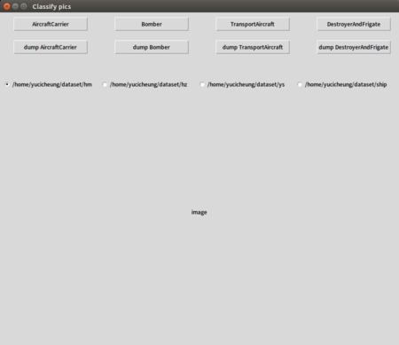
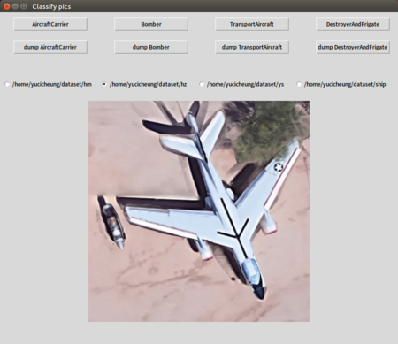
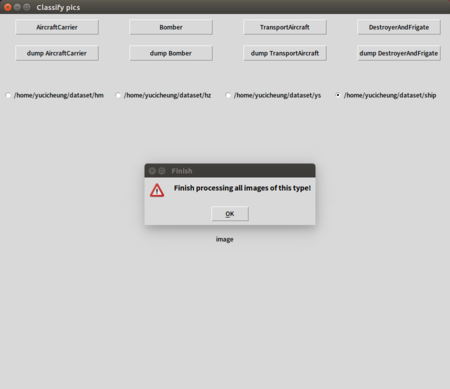

# Filtering pics
**Only able to run in Linux**.

If you need description in Chinese, please visit [my CSDN blog](https://blog.csdn.net/yucicheung/article/details/79905579) or [my own website](http://yucicheung.me/2018/04/11/%E5%BB%BA%E5%BA%93%E6%97%B6%E5%B8%AE%E5%8A%A9%E7%AD%9B%E9%80%89%E5%9B%BE%E7%89%87%E7%9A%84GUI%E5%B0%8F%E5%B7%A5%E5%85%B7-python-tkinter/).

Hope this tool may bring you a little help or inspiration.

## Desciption

This is a tool that helps you filter pics during building image database.

It achieves the following functions:
1. When click the radiobutton(**make sure the source directory is set correctly**), the program will check the sum of images in folder:
  - If sum is 0, inform user the folder is empty.
  - If not, show one picture in folder and make sure *category* folder and *categoryDump* folder exist.
2. when click *category* button, move picture showing into *category* folder.
3. when click *categoryDump* button, move picture showing into *categoryDump* folder.

## Prerequisites

Code is written in **python2.7.12**.
- python-tk 2.7.12-1~16.04
- PILLOW_VERSION = '5.0.0'

## Usage

If you want to test the code, run `main.py`.

Otherwise, before you run the `main.py`,please:
- modify the corresponding configuration in *main.py* file accrofing to your own needs;
- modify `ClassifyGUI.py` **if you have more than 4 categories to filter**.

## Example

Actual geomoetry of GUI is *900x750*, the pics shown below are resized with scaler 50%.

- When initializing the program.

- When clicking the radiobutton, i.e. when you choose the source path.

- When you finish processing all images in the catogory you choose.

